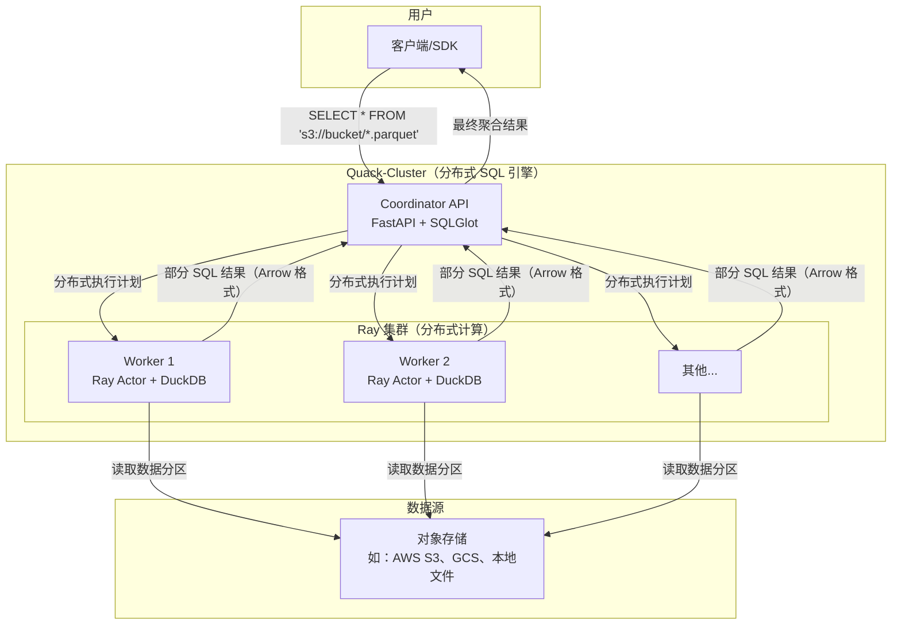

# 🦆 Quack-Cluster: 基于 DuckDB 和 Ray 的无服务器分布式 SQL 查询引擎

[](https://opensource.org/licenses/MIT)

**Quack-Cluster** 是一个高性能、无服务器的分布式 SQL 查询引擎，专为大规模数据分析而设计。它允许你直接在对象存储（如 AWS S3 或 Google Cloud Storage）中的数据上运行复杂的 SQL 查询，方法是利用 **Python**、**Ray** 分布式计算框架和超快速的 **DuckDB** 分析数据库的强大组合。

对于所有数据分析需求来说，这是一个理想的、轻量级的复杂大数据系统替代方案。

---

## ✨ 核心特性：一套现代化的分布式数据库

- **无服务器 & 分布式**：轻松在可扩展的 **Ray 集群**上运行 SQL 查询。无需为数据库需求管理复杂的服务器基础设施。
- **高速 SQL 处理**：利用 **DuckDB** 内存列式向量查询引擎的惊人速度和 Apache Arrow 数据格式的效率，实现极速分析。
- **在数据所在地查询**：直接从**AWS S3**、**Google Cloud Storage**和本地文件系统读取数据文件（Parquet、CSV 等），无需 ETL。
- **Python 原生集成**：使用 Python 构建，Quack-Cluster 可无缝集成到您现有的数据科学、数据工程和机器学习工作流程中。
- **开源技术栈**：使用**FastAPI**、**Ray** 和 **DuckDB** 等强大的现代开源技术构建。

---

## 🏛️ 架构：Quack-Cluster 如何执行分布式 SQL

Quack-Cluster 系统设计简洁且可扩展。它跨 Ray 集群分发 SQL 查询，每个工作节点使用嵌入的 DuckDB 实例并行处理部分数据。

1. **用户**向 Coordinator 的 API 端点发送标准 SQL 查询。
2. **Coordinator（FastAPI + SQLGlot）** 解析 SQL，识别目标文件（例如使用通配符如 `s3://my-bucket/data/*.parquet`），并生成分布式执行计划。
3. **Ray 集群**通过向多个**Worker**节点发送任务来协调执行。
4. 每个**Worker（Ray Actor）**运行一个嵌入的 **DuckDB** 实例，在部分数据上执行其分配的查询片段。
5. 部分结果由 Coordinator 高效聚合后返回给用户。

这种架构为 SQL 查询实现了大规模并行处理（MPP），将一系列文件转变为强大的分布式数据库。



---

## 🚀 快速开始：部署您自己的分布式 SQL 集群

您只需要 **Docker** 和 `make` 就可以运行一个本地 Quack-Cluster。

### 1️⃣ 前置条件

- [Docker](https://www.docker.com/products/docker-desktop/)
- `make`（Linux/macOS 预装；Windows 通过 WSL 可用）。

### 2️⃣ 安装与启动

```bash
# 1. 克隆此仓库
git clone https://github.com/your-username/quack-cluster.git
cd quack-cluster

# 2. 生成示例数据（在 ./data 目录创建 Parquet 文件）
make data

# 3. 构建并启动分布式集群
# 此命令启动一个 Ray 头节点和 2 个工作节点
make up scale=2
```

您的集群现在正在运行！您可以在 **Ray Dashboard** 查看集群状态：`http://localhost:8265`

---

## 👨‍🏫 教程：运行分布式 SQL 查询

使用任何 HTTP 客户端（如 `curl` 或 Postman）向 API 发送 SQL 查询。引擎会自动处理使用通配符的文件发现。

### 示例：从多个 Parquet 文件聚合销售数据

此查询计算所有 `data_part_*.parquet` 文件中每个产品的总销售额。

```bash
curl -X 'POST' \
  'http://localhost:8000/query' \
  -H 'Content-Type: application/json' \
  -d '{
    "sql": "SELECT product, SUM(sales) as total_sales FROM \"data_part_*.parquet\" GROUP BY product ORDER BY product"
  }'
```

**预期输出：**

```json
{
  "result": [
    {"product": "A", "total_sales": 420.0},
    {"product": "B", "total_sales": 400.0},
    {"product": "C", "total_sales": 300.0}
  ]
}
```

---

## 🚀 使用 Postman 测试

您可以使用提供的 Postman 集合轻松测试所有 API 功能。

1. **导入集合和环境**：
   - 在 Postman 中，点击 **Import** 并选择以下文件：
   - **集合**：`documentation/postman_collection/QuackCluster_API_Tests.json`
   - **环境**：`documentation/postman_collection/QuackCluster_postman_environment.json`

2. **激活环境**：
   - 在 Postman 右上角，从环境下拉列表中选择 **"Quack Cluster Environment"**。

3. **发送请求**：
   - 环境预配置了 `baseUrl` 变量为 `http://127.0.0.1:8000`。您现在可以运行集合中的任何预构建请求。

---

## 💡 使用 DuckDB 的强大分布式 SQL 功能

Quack-Cluster 支持丰富的 **DuckDB SQL 方言**子集，支持跨多个文件和目录的复杂分析查询。

### ✅ 支持的操作

- **基本查询**：`SELECT`、`FROM`、`WHERE`、`GROUP BY`、`ORDER BY`、`LIMIT`
- **聚合函数**：`COUNT()`、`SUM()`、`AVG()`、`MIN()`、`MAX()`
- **分布式连接**：`INNER JOIN`、`LEFT JOIN`、`FULL OUTER JOIN`（跨不同文件集）
- **高级 SQL**：
  - 子查询（如 `WHERE IN (...)`）
  - 使用 `WITH` 子句的公用表表达式（CTE）
  - 窗口函数（如 `SUM(...) OVER (PARTITION BY ...)`）
  - 高级 `SELECT` 语法，如 `SELECT * EXCLUDE (...)` 和 `SELECT COLUMNS('<regex>')`
- **文件系统函数**：使用 glob 模式查询 Parquet 或 CSV 文件集合（如 `"s3://my-data/2025/**/*.parquet"`）

---

## 🛠️ 开发与管理命令

使用这些 `make` 命令来管理您的开发生命周期。

| 命令 | 描述 |
| :--- | :--- |
| `make up scale=N` | 启动具有 `N` 个工作节点的集群 |
| `make down` | 安全地停止和移除运行中的容器 |
| `make logs` | 从所有服务实时查看日志 |
| `make build` | 代码更改后重新构建 Docker 镜像 |
| `make test` | 在 `ray-head` 容器内运行 `pytest` 测试套件 |
| `make clean` | **危险：** 停止容器并删除所有数据卷 |

---

## 🗺️ 项目路线图

- [✔] 支持分布式 `JOIN` 操作
- [✔] 支持窗口函数（`OVER`、`PARTITION BY`）
- [ ] 与 **Apache Iceberg** 或 **Delta Lake** 等元数据目录集成
- [ ] 用于更好开发者体验的专用 Python 客户端（SDK）

---

## 🤝 贡献

您所做的任何贡献都非常棒！请随时提交问题或 Pull Request。

## 🤖 AI 辅助开发

本项目利用 AI 工具加速开发并改进文档。

所有核心架构决策、调试和最终测试均为**人工驱动**，以确保质量和正确性。

---

## 📄 许可证

本项目根据 MIT 许可证获得许可。有关详细信息，请参阅 [LICENSE](LICENSE) 文件。
