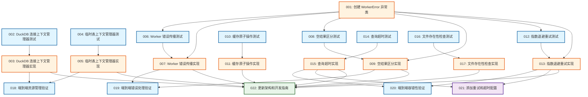

# Task Dependency Analysis Report

**Plan**: 2026-04-07-quack-cluster-bugfix-plan  
**Generated**: 2026-04-07  
**Total Tasks**: 22

---

## 1. Circular Dependencies

**Status**: ✅ PASS - No circular dependencies detected

All tasks form a valid directed acyclic graph (DAG). No task depends on itself directly or transitively.

---

## 2. RED-GREEN Pattern Validation

**Status**: ✅ PASS - All implementation tasks follow RED-GREEN pattern

All implementation tasks (except Task 001, which is infrastructure) have corresponding test tasks as dependencies:

| Impl Task | Test Dependency | Subject |
|-----------|----------------|---------|
| 003 | 002 | DuckDB 连接上下文管理器实现 |
| 005 | 004 | 临时表上下文管理器实现 |
| 007 | 006 | Worker 错误传播实现 |
| 009 | 008 | 空结果区分实现 |
| 011 | 010 | 缓存原子操作实现 |
| 013 | 012 | 指数退避重试实现 |
| 015 | 014 | 查询超时实现 |
| 017 | 016 | 文件存在性检查实现 |

**Exception**: Task 001 (WorkerError 异常类) is foundational infrastructure and doesn't require a preceding test.

---

## 3. Missing Dependencies

**Status**: ✅ PASS - All dependencies correctly specified

### Verified Dependency Chains:

**WorkerError Foundation (Task 001)**
- Task 006 (test) depends on 001 ✓
- Task 007 (impl) depends on 001, 006 ✓
- Task 008 (test) depends on 001 ✓
- Task 009 (impl) depends on 001, 008 ✓
- Task 012 (test) depends on 001 ✓
- Task 013 (impl) depends on 001, 012 ✓

**Integration Tests**
- Task 018 depends on 003, 005 (resource management impls) ✓
- Task 019 depends on 007, 009 (error handling impls) ✓
- Task 020 depends on 013, 015 (fault tolerance impls) ✓

**Configuration & Documentation**
- Task 021 depends on 013, 015 (retry/timeout impls) ✓
- Task 022 depends on all 8 impl tasks (003, 005, 007, 009, 011, 013, 015, 017) ✓

---

## 4. Topological Execution Order

Tasks can be executed in the following order (respecting all dependencies):

```
 1. [001] impl   - 创建 WorkerError 异常类
 2. [002] test   - 资源管理 - DuckDB 连接上下文管理器测试
 3. [004] test   - 资源管理 - 临时表上下文管理器测试
 4. [010] test   - 并发安全 - 缓存原子操作测试
 5. [014] test   - 容错性 - 查询超时测试
 6. [016] test   - 文件验证 - 文件存在性检查测试
 7. [003] impl   - 资源管理 - DuckDB 连接上下文管理器实现
 8. [005] impl   - 资源管理 - 临时表上下文管理器实现
 9. [006] test   - 错误处理 - Worker 错误传播测试
10. [008] test   - 错误处理 - 空结果区分测试
11. [011] impl   - 并发安全 - 缓存原子操作实现
12. [012] test   - 容错性 - 指数退避重试测试
13. [015] impl   - 容错性 - 查询超时实现
14. [017] impl   - 文件验证 - 文件存在性检查实现
15. [007] impl   - 错误处理 - Worker 错误传播实现
16. [009] impl   - 错误处理 - 空结果区分实现
17. [013] impl   - 容错性 - 指数退避重试实现
18. [018] test   - 集成测试 - 端到端资源管理验证
19. [019] test   - 集成测试 - 端到端错误处理验证
20. [020] test   - 集成测试 - 端到端容错性验证
21. [021] config - 配置更新 - 添加重试和超时配置
22. [022] docs   - 文档更新 - 更新架构和开发指南
```

### Parallel Execution Opportunities

Tasks at the same level can be executed in parallel:

**Level 1** (no dependencies):
- 001, 002, 004, 010, 014, 016

**Level 2** (after Level 1):
- 003, 005, 006, 008, 011, 012, 015, 017

**Level 3** (after Level 2):
- 007, 009, 013, 018

**Level 4** (after Level 3):
- 019, 020, 021

**Level 5** (after Level 4):
- 022

---

## 5. Dependency Graph (Mermaid)



---

## 6. Critical Path Analysis

**Critical Path**: 001 → 006 → 007 → 019 → 022

This is the longest dependency chain and determines the minimum project duration.

**Critical Path Tasks**:
1. Task 001: WorkerError 异常类 (foundation)
2. Task 006: Worker 错误传播测试 (test)
3. Task 007: Worker 错误传播实现 (impl)
4. Task 019: 端到端错误处理验证 (integration test)
5. Task 022: 文档更新 (docs)

**Alternative Critical Paths** (same length):
- 001 → 008 → 009 → 019 → 022
- 001 → 012 → 013 → 020 → 022

---

## 7. Dependency Clusters

### Cluster 1: Resource Management (Independent)
- 002 → 003 → 018
- 004 → 005 → 018

**Characteristics**: No external dependencies, can start immediately

### Cluster 2: Error Handling (Depends on 001)
- 001 → 006 → 007 → 019
- 001 → 008 → 009 → 019

**Characteristics**: Requires WorkerError foundation

### Cluster 3: Concurrency (Independent)
- 010 → 011 → 022

**Characteristics**: No external dependencies, can start immediately

### Cluster 4: Fault Tolerance (Depends on 001)
- 001 → 012 → 013 → 020, 021
- 014 → 015 → 020, 021

**Characteristics**: Mixed dependencies (012-013 need 001, 014-015 independent)

### Cluster 5: File Validation (Independent)
- 016 → 017 → 022

**Characteristics**: No external dependencies, can start immediately

---

## 8. Risk Assessment

### High-Risk Dependencies

**Task 001 (WorkerError)** - Single Point of Failure
- Blocks: 006, 007, 008, 009, 012, 013
- Impact: 6 tasks directly blocked, 9 tasks transitively blocked
- Mitigation: Prioritize completion, ensure thorough review

**Task 022 (Documentation)** - High Fan-in
- Depends on: 8 implementation tasks
- Impact: Cannot complete until all features implemented
- Mitigation: Start documentation incrementally as tasks complete

### Medium-Risk Dependencies

**Integration Tests (018, 019, 020)**
- Each depends on 2 implementation tasks
- Impact: Delays in any impl task delay integration validation
- Mitigation: Ensure impl tasks are thoroughly unit tested

---

## 9. Recommendations

### Execution Strategy

1. **Start in Parallel**:
   - Task 001 (WorkerError - critical path)
   - Task 002, 004 (Resource management tests)
   - Task 010 (Cache test)
   - Task 014 (Timeout test)
   - Task 016 (File validation test)

2. **Second Wave** (after Task 001):
   - Task 006, 008, 012 (Error handling and retry tests)
   - Task 003, 005, 011, 015, 017 (Independent impls)

3. **Third Wave** (after tests complete):
   - Task 007, 009, 013 (Error handling and retry impls)
   - Task 018 (Resource management integration)

4. **Final Wave**:
   - Task 019, 020 (Error and fault tolerance integration)
   - Task 021 (Config)
   - Task 022 (Docs - can be incremental)

### Quality Gates

- After Task 001: Review WorkerError design with team
- After Tasks 003, 005, 007, 009, 011, 013, 015, 017: Run full test suite
- After Tasks 018, 019, 020: Performance regression testing
- Before Task 022: Ensure all BDD scenarios pass

---

## Summary

✅ **No circular dependencies**  
✅ **All impl tasks follow RED-GREEN pattern**  
✅ **All dependencies correctly specified**  
✅ **Clear execution order established**  

The plan is well-structured with proper test-driven development practices. The critical path is 5 tasks long, with multiple opportunities for parallel execution. Task 001 is the most critical dependency, blocking 6 direct dependents.
