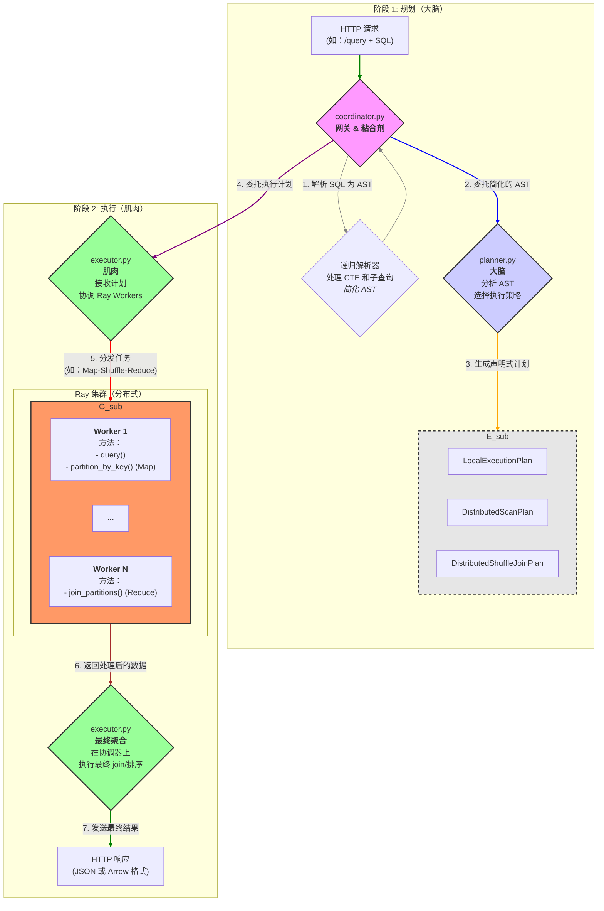

# Quack-Cluster 系统架构

本文档描述了 Quack-Cluster 的高层架构、设计理念以及每个核心组件的职责。目标是帮助读者建立对系统整体工作的扎实理解。

---

## 1. 设计理念

Quack-Cluster 架构基于几个关键原则，确保系统模块化、可维护且易于扩展：

- **关注点分离**：规划查询（做什么）和执行查询（怎么做）的逻辑严格分离。
- **单一职责原则（SRP）**：每个模块和类只有一个主要职责。`Planner` 只负责规划，`Executor` 只负责执行，`Worker` 只负责在数据上执行特定任务。
- **声明式执行计划**：`Planner` 产生一个"计划"，这是一个简单的数据结构（Pydantic 模型）。该计划声明性地描述要执行的步骤，而不包含执行逻辑本身。这使得工作流程透明且易于调试。
- **可扩展性**：通过分离组件，添加新功能（如新的连接策略或优化）可以在不影响系统其他部分的情况下，通过修改或添加组件来完成。

---

## 2. 高层执行流程

每个进入系统的 SQL 查询都会经过一系列明确定义的步骤。

---

## 3. 目录结构与核心组件

以下是 `quack_cluster/` 目录中每个核心组件的详细说明：

### `coordinator.py`

- **角色**：主入口点（网关）和连接其他组件的"粘合剂"。
- **职责**：
  1. **端点管理**：提供 FastAPI `/query` 端点接收 SQL 请求。
  2. **初始解析**：使用 `sqlglot` 将 SQL 字符串解析为抽象语法树（AST）。
  3. **递归解析器**：`resolve_and_execute` 递归逻辑处理复杂 SQL 结构，如 **CTE（WITH 子句）** 和 **子查询**。它通过先执行这些部分来"简化"AST。
  4. **委托**：AST 简化后，将任务委托给 `Planner` 创建计划，并委托给 `Executor` 执行计划。

### `planner.py`

- **角色**：查询引擎的"大脑"。
- **职责**：
  1. **AST 分析**：接收协调器传来的简化 AST。
  2. **策略选择**：包含决定查询最佳执行方式的所有逻辑。决定查询应该：
     - 在协调器上本地运行（`LocalExecutionPlan`）
     - 作为分布式文件扫描运行（`DistributedScanPlan`）
     - 作为分布式 shuffle join 运行（`DistributedShuffleJoinPlan`）
  3. **计划创建**：生成包含 `Executor` 执行查询所需信息的 `ExecutionPlan` 对象，如表名、连接键和 Workers 的 SQL 模板。

### `execution_plan.py`

- **角色**："契约"或数据蓝图。
- **职责**：
  1. **结构定义**：定义一系列 Pydantic 类（`LocalExecutionPlan`、`DistributedScanPlan` 等）作为执行计划的标准数据结构。
  2. **数据验证**：通过 Pydantic 验证确保 `Planner` 提供 `Executor` 所需的所有信息。这防止了因数据不一致导致的错误。

### `executor.py`

- **角色**：查询引擎的"肌肉"。
- **职责**：
  1. **计划执行**：接收协调器传来的 `ExecutionPlan` 对象。
  2. **Ray 协调**：包含与 Ray 交互的所有逻辑。调用 `DuckDBWorker.remote()`、分发任务并收集结果（`asyncio.gather`）。
  3. **流程实现**：为每种计划类型实现特定工作流程（如 `DistributedShuffleJoinPlan` 的 map-shuffle-reduce 流程）。
  4. **最终聚合**：Workers 处理完数据后，`Executor` 负责在返回最终结果前，在协调器上执行最终聚合或排序步骤。

### `worker.py`

- **角色**：单个分布式工作单元。
- **职责**：
  1. **Ray Actor**：定义为 `@ray.remote class DuckDBWorker`。每个 Worker 运行在自己的进程中。
  2. **特定任务执行**：提供在数据上执行重活的方法，如：
     - `query()`：在一组 Parquet 文件上执行查询。
     - `partition_by_key()`：读取数据并按连接键分区（Map 阶段）。
     - `join_partitions()`：接收来自其他 Workers 的数据分区并本地执行连接（Reduce 阶段）。
  3. **隔离**：每个 Worker 有自己的 DuckDB 连接，不了解其他 Workers。它只接收任务、执行并返回结果。
